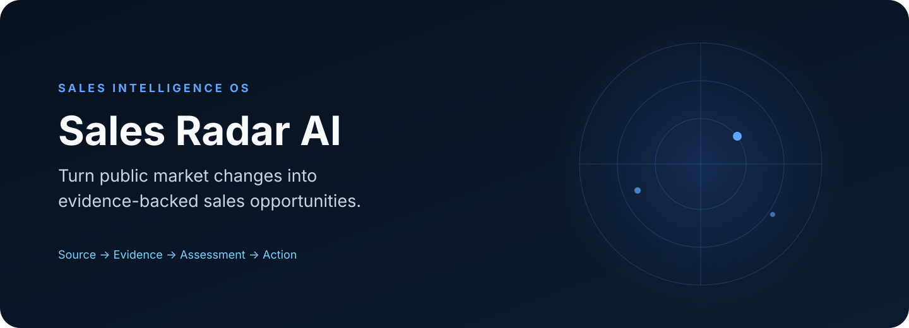
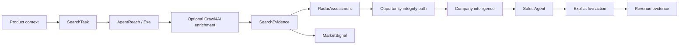

<div align="center">
  

  <p><strong>Turn public market changes into evidence-backed sales opportunities.</strong></p>

  <p>
    <a href="https://github.com/jinngimk-lang/sales-radar-ai/actions/workflows/ci.yml"></a>
    <a href="LICENSE"></a>
    <a href="https://github.com/jinngimk-lang/sales-radar-ai/releases"></a>
  </p>

  <p>
    <a href="https://sales-radar-ai.vercel.app">Live demo</a> ·
    <a href="README.zh-CN.md">简体中文</a> ·
    <a href="CONTRIBUTING.md">Contributing</a> ·
    <a href="docs/AGENT_INTEGRATION.md">Use with AI agents</a>
  </p>
</div>

Sales Radar AI is an open-source sales intelligence workspace for discovering market signals, preserving source evidence, assessing commercial relevance, researching companies and turning verified context into sales actions.

It is not a customer database and it does not manufacture buyer intent. Every result stays on an explicit path from source to recommendation:

```text
Signal Discovery
  → Crawl / Search
  → Evidence Ranking
  → Opportunity Assessment
  → Company Research
  → Agent Action
  → Live Execution
  → Revenue Settlement
```

## Why Sales Radar AI

- **Evidence first** — real URLs, source provenance, capture time and validation status remain attached to results.
- **More than lead lists** — see high-match opportunities, potential opportunities, market signals and items that still need review.
- **Agent-ready** — coding agents receive repository guardrails; runtime agents get an authenticated, machine-readable API contract.
- **Provider-oriented** — search, page acquisition and agent runtimes are separate adapters instead of hard-coded model dependencies.
- **Human-confirmed sales truth** — Opportunity is not Customer, evidence is not purchase confirmation, and external actions require explicit user intent.

## Product workspace

| Workspace | Purpose |
| --- | --- |
| AI command center | Describe a sales objective and coordinate search, research and action tools. |
| Market radar | Observe real public sources, signals, freshness, risk and commercial assessments. |
| Company research | Understand an organization, its evidence and what a salesperson should verify next. |
| Revenue center | Prioritize evidence-backed opportunities and explicitly run protected live workflows. |

## Architecture



The trust hierarchy is non-negotiable:

```text
Source ≠ Evidence ≠ Fact ≠ Assessment ≠ Opportunity ≠ Customer
```

## Current capability status

| Capability | Repository status | Runtime requirement |
| --- | --- | --- |
| SearchTask and evidence pipeline | Implemented and tested | PostgreSQL plus an enabled real search provider |
| AgentReach / Exa | Implemented | `mcporter` and a valid `EXA_API_KEY` |
| Radar assessment and opportunity integrity | Implemented and tested | Real SearchEvidence |
| Company research and research trace | Implemented and tested | Workspace-owned evidence |
| Optional Crawl4AI enrichment | Adapter implemented, disabled by default | Separately deployed Crawl4AI service |
| OpenAI sales agent | Implemented | Server-side OpenAI configuration |
| LiveKit-compatible agent runtime | HTTP bridge implemented, disabled by default | Separately deployed compatible runtime |
| Revenue Live | Protected explicit-run workflow | Operator token and optional Browserbase account |

See [runtime deployment](docs/INTELLIGENCE_RUNTIME_DEPLOYMENT.md) and the [roadmap](docs/ROADMAP.md) for the difference between code availability and verified deployment.

## Quick start

### Requirements

- Node.js 20+
- PostgreSQL
- npm

### Frontend

```bash
cp .env.example .env
npm ci
npm run dev
```

The Vite development proxy targets `http://localhost:8787` by default.

### Backend

```bash
cd backend
cp .env.example .env
npm ci
npm run prisma:generate
npm run prisma:migrate
npm run dev
```

Required backend variables:

```dotenv
DATABASE_URL=postgresql://...
JWT_SECRET=replace-with-a-long-random-secret
```

Real web search additionally requires:

```dotenv
AGENT_REACH_MCPORTER_PATH=mcporter
EXA_API_KEY=
```

Provider keys, operator tokens and browser credentials are server-only. Never expose them through a `VITE_*` variable or commit them to Git.

## Optional providers

The backend supports optional provider configuration for Qwen-compatible AI, OpenAI market research, Crawl4AI content acquisition, a LiveKit-compatible agent runtime and Browserbase live execution. All are disabled or fail safely when not configured. Copy values from [`backend/.env.example`](backend/.env.example) and follow [`docs/INTELLIGENCE_RUNTIME_DEPLOYMENT.md`](docs/INTELLIGENCE_RUNTIME_DEPLOYMENT.md).

## Use with AI agents

Sales Radar AI supports two distinct agent workflows:

1. **Coding agents** read [`AGENTS.md`](AGENTS.md), [`CONTEXT.md`](CONTEXT.md) and [`.agent/SKILL_REGISTRY.md`](.agent/SKILL_REGISTRY.md) before changing the repository.
2. **Runtime agents** use the authenticated workflows documented in [`docs/AGENT_INTEGRATION.md`](docs/AGENT_INTEGRATION.md) and [`docs/openapi/agent-api.yaml`](docs/openapi/agent-api.yaml).

These interfaces are designed for Codex, GitHub Copilot, Claude Code and other agent runners that can read repository instructions or call HTTP tools. Vendor-specific orchestration remains outside the core business domain.

## Verification

```bash
# Frontend
npm run typecheck
npm test
npm run build

# Backend
cd backend
npm run prisma:generate
npm run prisma:validate
npm run typecheck
npm test
npm run build
```

GitHub Actions runs the core frontend and backend checks for pull requests and updates to `main`.

## Contributing

We welcome contributions for evidence quality, search/reranking, provider adapters, browser automation, agent orchestration, company research and safe CRM workflows. Start with [`CONTRIBUTING.md`](CONTRIBUTING.md), choose an issue template, and keep each pull request focused on one verifiable capability.

## Security and data integrity

- Never commit API keys, cookies, contact exports or private customer data.
- Never infer emails, phone numbers, people or purchase intent from names or domains.
- Never bypass workspace ownership, evidence validation or Lead Quality Gate.
- Never describe a draft, opened channel or browser action as sent/completed unless a real provider confirms it.
- Report security issues privately using [`SECURITY.md`](SECURITY.md).

## License

Licensed under the [Apache License 2.0](LICENSE).
