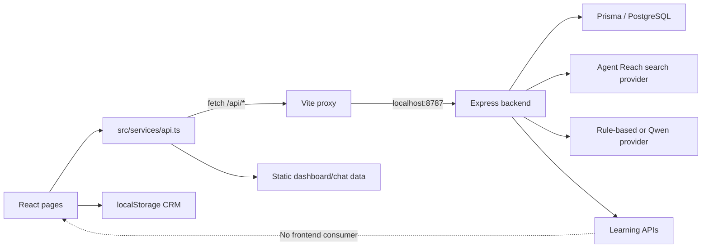

# Sales Radar AI Frontend–Backend Integration Audit v1

**Audit date:** 2026-07-27  
**Audit type:** Read-only architecture and QA review  
**Project audited:** `sales-radar-ai` frontend and `backend/` service  
**Overall verdict:** **Partially integrated; not fully production-connected**

## 1. Executive conclusion

The current frontend is no longer entirely mock-based. It contains a working HTTP client and several pages call matching Express backend routes. The strongest integrations are:

- Search intent and product understanding
- Search task creation and polling
- Lead listing and Customer Detail
- Lead Research and research feedback
- Lead Outcome create/read/update
- Contact discovery and ranking
- Channel discovery
- Outreach generation

However, the application remains a hybrid prototype:

- Dashboard metrics and charts are static mock datasets.
- Account, API key, quotas, search history, favorites, CRM pipeline, and CRM integrations are UI demonstrations.
- CRM favorites, status, tags, and notes use browser `localStorage`, not the backend.
- AI chat sessions partially use backend leads, but chat history is mock, messages are not persisted, and “chat” is a wrapper around lead analysis rather than a conversational backend.
- Learning APIs exist in the backend but are not called anywhere in the frontend.
- No frontend authentication or tenant identity is sent; the backend uses a demo-user mechanism.
- No frontend or backend server was listening during the audit, so the code is API-wired but was not operational end-to-end at audit time.

Therefore, the frontend must not be described as “fully connected” or “production-connected.” It is **feature-selectively connected to a local backend API**.

## 2. Integration architecture

Frontend API base configuration:

- `src/services/api.ts:57` uses `VITE_API_BASE_URL`, defaulting to `/api`.
- `.env` sets `VITE_API_BASE_URL=/api`.
- `vite.config.ts` proxies `/api` to `http://localhost:8787`.
- `backend/src/app.ts:17-23` mounts the backend routers under `/api`.

This configuration is valid for local development. It is not evidence of a deployed production API.

## 3. Page-by-page integration matrix

| Frontend page | Backend-connected data | Mock/local/demo data | Verdict |
|---|---|---|---|
| Landing (`/`) | None | All marketing statistics, case study, platform claims, and example lead content are hardcoded | UI demonstration |
| Discover (`/app/discover`) | Product profiles, search intent, product understanding, search tasks, lead list, outreach generation | CRM filters depend on localStorage; “latest” sort preserves existing order; marketing-style scanning text | Substantially API-wired, not fully production-ready |
| Customer Detail (`/app/customer/:id`) | Lead detail, ranked contacts, channel profile, Lead Research, feedback, Outcome, products, contact/channel discovery, outreach, follow-up plan | CRM favorite/status/tags/notes remain localStorage | Strongest backend integration; hybrid due to local CRM |
| AI Assistant (`/app/assistant`) | Session list attempts to use backend leads; sending a prompt calls lead analysis | Default messages are static; session fallback is mock; no conversation persistence; several controls are UI-only | Partially connected |
| Dashboard (`/app/dashboard`) | None for top-level statistics/charts | All charts and KPI cards are static; CRM funnel is calculated from localStorage | Not backend-connected |
| Account (`/app/account`) | None | Account identity, API key, quotas, history, favorites, pipeline, integrations, and buttons are hardcoded | UI demonstration |

### 3.1 Landing page

`LandingPage.tsx` imports no API service. Search actions only navigate to the Discover route. Its “real-time” lead example, statistics, industries, and product claims are presentation constants.

**Production data used:** none.

### 3.2 Discover page

The page calls:

- `getProductProfiles()` on mount (`DiscoverPage.tsx:67`)
- `analyzeSearchIntent()` and `understandProduct()` for a non-empty query
- `searchCustomers()` after the intent/product calls (`DiscoverPage.tsx:89`)
- `generateOutreach()` for message generation (`DiscoverPage.tsx:134,141`)

`searchCustomers()` performs this real backend flow:

1. POST `/api/search-task`
2. Poll GET `/api/search-task/:id`
3. GET `/api/leads?keyword=...&sort=desc`
4. Convert backend leads into frontend `Customer` objects
5. Apply some filters client-side

The SearchTask backend hardcodes provider `agent-reach` (`backend/src/services/search-task.service.ts:29`) and persists normalized leads through Prisma.

Important limitations:

- The search provider requires Agent Reach and its runtime configuration.
- The client stores completed query keys only in an in-memory `Set`; reloads lose the cache, while same-session repeats may skip a fresh search.
- Platform, region, customer type, intent, favorite, and follow-up filtering is partly client-side.
- Favorites and follow-up filters read localStorage CRM records, not backend outcomes.
- Search errors are not presented through a durable page-level error state.
- “Latest published” sorting currently returns the existing order rather than performing a date sort.

**Verdict:** Search is API-wired and can use a real external search provider, but it is not yet demonstrably production-operational.

### 3.3 Customer Detail

On load, the page calls real backend services for:

- `getCustomerById`
- `getRankedContacts`
- `getChannelProfile`
- `getLeadResearch`
- `getLeadOutcome`
- `getProductProfiles`

User actions call:

- `discoverContacts`
- `rankContacts`
- `discoverChannel`
- `researchLead`
- `submitLeadResearchFeedback`
- `createLeadOutcome` / `updateLeadOutcome`
- `generateOutreach`
- `generateFollowUpPlan`

These frontend paths match backend routes under `/api/leads/:id/*`.

The page still has a separate CRM panel backed by `useCrmRecord()` and `useCrmActions()`. Favorite, simplified follow-up status, custom tags, and notes are not stored with the backend lead or outcome. This creates two different sources of sales state:

1. Backend `LeadOutcome`
2. Browser-local `CrmRecord`

They are not synchronized.

Secondary load failures for contacts, channel, research, outcome, and products are generally converted to empty/null state. This prevents the page from crashing but can make backend outages look like “no data.”

**Verdict:** Customer Detail is strongly backend-wired, but the split CRM state and silent failure behavior prevent a full production-connected rating.

### 3.4 AI Assistant

The assistant is only partially integrated:

- `getChatSessions()` requests `/api/leads?sort=desc`.
- If that request fails, it silently returns static `CHAT_SESSIONS`.
- `getChatMessages()` always returns `DEFAULT_CHAT_MESSAGES`.
- `sendChatMessage()` identifies a lead and calls POST `/api/leads/:id/analyze`.
- The response is formatted client-side based on keyword matching.

There is no backend `/chat` or `/messages` route, no stored conversation model, and no message history persistence. Selecting a session changes the active ID but does not reload that session’s messages. “New conversation” and history search controls do not implement backend behavior.

**Verdict:** Lead-analysis-assisted UI, not a production chat system.

### 3.5 Dashboard

The following service methods return static datasets after artificial delays:

- `getDashboardStats()` → `DASHBOARD_STATS`
- `getDiscoveryTrend()` → `DISCOVERY_TREND`
- `getIndustryDistribution()` → `INDUSTRY_DISTRIBUTION`
- `getPlatformDistribution()` → `PLATFORM_DISTRIBUTION`

The CRM funnel uses `getCrmStats()`, which aggregates localStorage records.

The backend has Learning analytics APIs that could supply real business metrics, but the Dashboard does not call them.

**Verdict:** Not backend-connected.

### 3.6 Account page

The page defines local constants for:

- Search history (`AccountPage.tsx:30`)
- Favorite customers (`AccountPage.tsx:38`)
- CRM pipeline (`AccountPage.tsx:45`)
- API key (`AccountPage.tsx:57`)
- API usage quotas
- User profile and subscription

Edit, upgrade, regenerate key, revoke key, repeat search, CRM connection, and preference controls do not call backend APIs. The displayed `https://api.salesradar.ai/v1/customers/search` example does not match the implemented backend route structure.

**Verdict:** UI demonstration only.

## 4. Backend route coverage

### 4.1 Routes consumed by the frontend

| Backend route | Frontend consumer | Status |
|---|---|---|
| POST `/api/search/intent` | Discover | Connected |
| POST `/api/product/understanding` | Discover | Connected |
| GET `/api/products` | Discover, Customer Detail | Connected |
| POST `/api/search-task` | Search service flow | Connected |
| GET `/api/search-task/:id` | Search polling | Connected |
| GET `/api/leads` | Discover, Assistant sessions | Connected |
| GET `/api/leads/:id` | Customer Detail | Connected |
| POST `/api/leads/:id/analyze` | Assistant message flow | Connected |
| GET/POST `/api/leads/:id/research` | Customer Detail | Connected |
| POST `/api/leads/:id/research/feedback` | Customer Detail | Connected |
| GET/POST/PUT `/api/leads/:id/outcome` | Customer Detail | Connected |
| POST `/api/leads/:id/outreach` | Discover, Customer Detail | Connected |
| GET/POST `/api/leads/:id/contacts` | Customer Detail | Connected |
| POST `/api/leads/:id/contacts/rank` | Customer Detail | Connected |
| GET `/api/leads/:id/contacts/ranked` | Customer Detail | Connected |
| GET/POST `/api/leads/:id/channels` | Customer Detail | Connected |

### 4.2 Implemented backend routes not meaningfully consumed

| Backend route | Gap |
|---|---|
| GET `/api/health` | No frontend health/readiness check |
| POST `/api/products` | Service wrapper exists, but no page calls it |
| GET `/api/products/:id` | Service wrapper exists, but no page calls it |
| PUT `/api/products/:id` | Service wrapper exists, but no page calls it |
| POST `/api/products/:id/analyze` | Service wrapper exists, but no page calls it |
| GET `/api/leads/:id/outreach` | No frontend service or history UI consumes it |
| GET `/api/learning/overview` | No frontend service wrapper or page |
| GET `/api/learning/products` | No frontend service wrapper or page |
| GET `/api/learning/insights` | No frontend service wrapper or page |

### 4.3 Frontend features with no backend API

- Dashboard KPIs, trend, industry distribution, and platform distribution
- Persistent chat sessions and chat messages
- Account/profile management
- Authentication and frontend session handling
- API key lifecycle
- Usage quotas/billing
- Search history
- Favorite customer list in Account
- CRM tags, notes, favorite status, and simplified pipeline
- CRM provider integrations
- Subscription upgrade and preference settings

## 5. Mock data inventory

### Static mock modules

- `src/data/dashboard.ts`
  - Dashboard statistics
  - Discovery trend
  - Industry distribution
  - Platform distribution
  - Chat sessions
  - Default chat messages
  - Legacy mock AI replies
- `src/data/customers.ts`
  - A legacy static customer dataset remains in the repository, but the current search/detail service path no longer imports it.
- `src/pages/AccountPage.tsx`
  - Account, API key, quotas, search history, favorites, and CRM pipeline are hardcoded in the page.
- `src/pages/LandingPage.tsx`
  - Marketing statistics and lead examples are hardcoded.

### Silent fallback

`getChatSessions()` falls back to mock sessions when `/api/leads` fails. This is especially risky for QA and production monitoring because the page can appear populated while the backend is unavailable.

## 6. localStorage usage

All browser persistence is concentrated in `src/lib/crmStore.ts`.

- Storage key: `sales_radar_crm_v1`
- Read: `window.localStorage.getItem(...)`
- Write: `window.localStorage.setItem(...)`
- Stored fields include:
  - favorite state
  - simplified follow-up status
  - custom tags
  - notes
  - last-contacted and updated timestamps

The storage implementation catches and suppresses parsing, privacy-mode, and quota errors. It provides no cross-device synchronization, user ownership, server backup, conflict resolution, audit trail, or multi-user consistency.

The following UI depends on this local state:

- Customer card CRM controls
- Customer Detail CRM panel
- Discover favorite/follow-up filters
- Dashboard CRM funnel

This state is independent from backend Lead Outcome records.

## 7. Requested capability verdicts

| Capability | Verdict | Evidence |
|---|---|---|
| Customer Detail | **API-wired, hybrid** | Real lead/research/outcome/contact/channel/outreach routes; CRM subpanel remains localStorage |
| Lead Research | **Backend-connected** | GET/POST research and POST feedback are called by Customer Detail and customer cards; Prisma-backed backend services exist |
| Search | **Backend-connected in code** | SearchTask creation/polling, Agent Reach provider, Prisma lead persistence, and lead retrieval are wired; runtime was not active during audit |
| Outcome | **Backend-connected** | GET/POST/PUT Lead Outcome routes are called and persisted through backend services |
| Learning | **Not frontend-connected** | Backend analytics and insight routes exist, but no frontend service wrapper, route, page, or component consumes them |

None of these should be labeled fully “production-connected” until deployment, authentication, tenant isolation, runtime health, and end-to-end tests are verified.

## 8. Production-readiness findings

### Critical

1. **No end-to-end runtime was active during the audit.** Nothing was listening on frontend port 5173, backend port 8787, or local PostgreSQL port 5432.
2. **No real frontend authentication/authorization flow.** The API client sends no bearer token or session credential, while backend services use a demo user. Production tenant isolation is not established.
3. **Split sales state.** Backend Lead Outcome and localStorage CRM status can contradict one another.

### High

4. **Learning is backend-only.** The product’s feedback-to-learning loop is not visible or usable from the frontend.
5. **Dashboard is entirely mock/local.** It does not reflect backend leads, outcomes, research, outreach, or learning.
6. **Account is entirely demonstrational.** Displayed credentials, quotas, identities, history, and integrations are not authoritative.
7. **Chat is not a real conversation service.** Messages and sessions are not persisted; default history is mock.
8. **Backend failures can be hidden.** Several calls use empty/null/mock fallbacks without an explicit degraded-state indicator.
9. **AI mode is not necessarily a real model.** The backend defaults to `rule-based`; Qwen is used only for selected task types when configured. Outreach and many other tasks intentionally resolve to the rule-based fallback.

### Medium

10. Product create/update/analyze wrappers exist but have no frontend management workflow.
11. Outreach history exists in the backend but is not displayed.
12. Search completion caching is in-memory and can produce stale same-session behavior.
13. Several user-facing controls are nonfunctional demonstrations.
14. No frontend health check or API readiness indicator exists.

## 9. Verification notes

- Backend TypeScript type-check completed successfully with `tsc --noEmit`.
- The backend test suite could not be executed in this audit environment because the test runner failed during startup with an operating-system memory/user-info error. This is an audit-environment limitation, not a confirmed application test failure.
- The first package-manager verification attempt tried to reorganize installed dependency folders; those dependency folders were restored, and `git status --short` remained clean.
- No application source code was modified.

## 10. Final assessment

Sales Radar AI has a meaningful backend integration foundation, especially around Search, Customer Detail, Lead Research, Outcome, contact/channel discovery, and outreach. It is not yet an end-to-end production SaaS frontend.

The most accurate release statement is:

> **Core lead workflows are connected to a local backend API; analytics, account management, CRM persistence, chat history, and the frontend learning loop remain mock, local-only, or unimplemented.**

